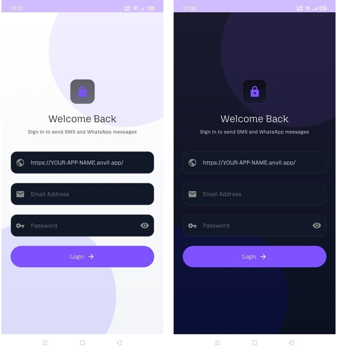
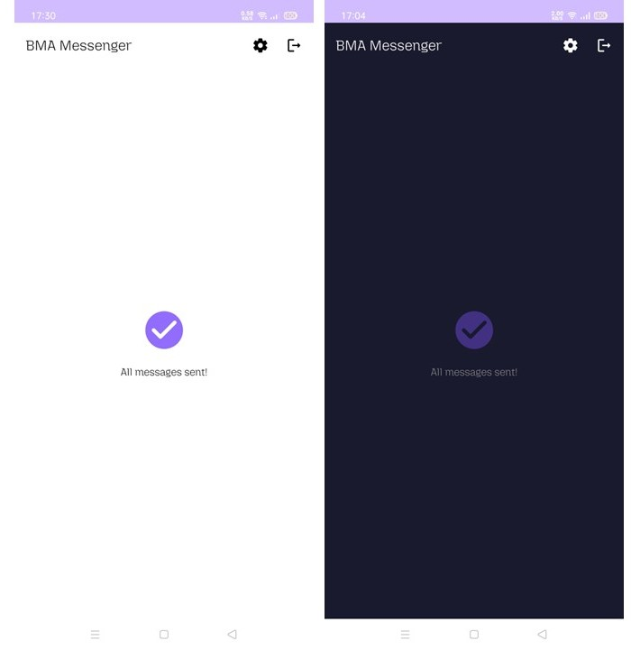
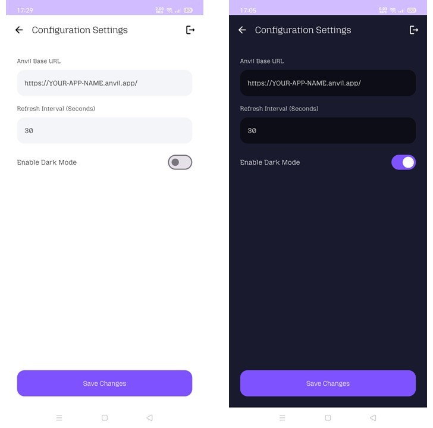
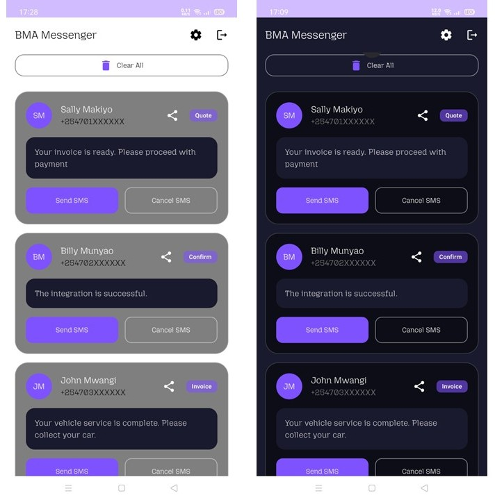
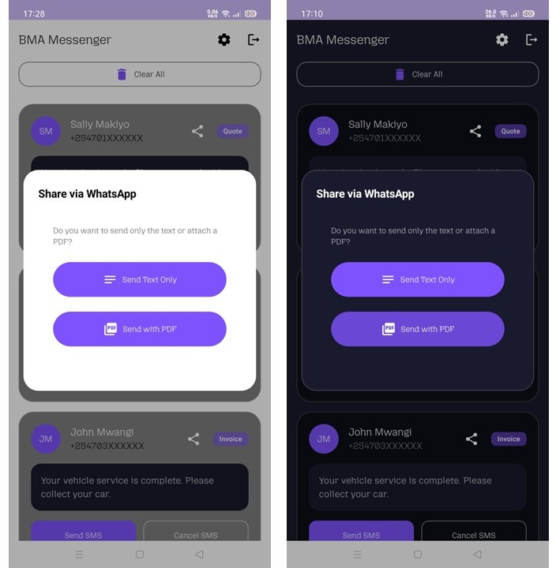

# BMA Messenger

BMA Messenger is an Android application for sending SMS messages and sharing PDF documents via WhatsApp (tested on v2.26.5.74). It is built with Jetpack Compose, Retrofit, and Kotlin Coroutines.

---

## ✨ Features

- **Send SMS** — Send individual or bulk SMS messages directly from the app.
- **Share PDF** — Generate job card PDFs and share them via WhatsApp.
- **Pull to Refresh** — Swipe down to reload the list of pending messages.
- **Configurable Settings** — Set your Anvil base URL and message refresh interval.
- **Dark Theme** — A clean, modern dark UI built with Material 3.

---

## 📋 Prerequisites

Before you begin, ensure you have the following:

| Requirement | Details |
|---|---|
| Android Studio | Ladybug or newer |
| Android Device | Physical device with an active SIM card |
| Anvil Works Account | Create account in [Anvil](https://anvil.works) |
| Python | Version 3.10+ (if running the Uplink locally) |
| wkhtmltopdf | Render HTML to PDF in Windows [Download wkhtmltopdf](https://wkhtmltopdf.org/downloads.html) |

---

## 🚀 Getting Started

### 1. Clone the BMAMessenger Repository

```bash
git clone https://github.com/realrkm/bmamessenger.git
cd BMAMessenger
```

### 2. Install the Anvil Uplink (Backend)

The backend is powered by Anvil, a Python-based web app platform. Before installing dependencies, create and activate a virtual environment to keep your project packages isolated.

**Step 1 — Create the virtual environment:**

| OS | Command |
|---|---|
| Windows | `python -m venv venv` |

**Step 2 — Activate the virtual environment:**

| OS | Command |
|---|---|
| Windows (Command Prompt) | `venv\Scripts\activate.bat` |
| Windows (PowerShell) | `venv\Scripts\Activate.ps1` |

> Once activated, your terminal prompt will be prefixed with `(venv)`, confirming the environment is active.

**Step 3 — Install the python libraries from requirements.txt**

```bash
pip install -r requirements.txt
```

> To deactivate the virtual environment when you are done, run `deactivate`.

### 3. Create A Self Signed HTTPS Certificate
a) Download mkcert - https://github.com/filosottile/mkcert/releases

b) Open CMD and run "mkcert-v1.4.4-windows-amd64.exe YOUR-LAN-IP (e.g. 192.168.1.12)"
   NB: 192.168.1.12.pem and 192.168.1.12-key.pem will be created

c) Run "mkcert-v1.4.4-windows-amd64.exe -CAROOT". 

   NB. This prints the file path where the local Certificate Authority (CA) files are stored E.G "C:\Users\ADMIN\AppData\Local\mkcert"

d) Go to C:\Users\ADMIN\AppData\Local\mkcert and rename "rootCA.pem" to "BMAMessenger-rootCA.crt"

### 4. How To Install a Local Certificate Authority on an Android Phone

Android 7.0 (Nougat) and above does not trust user-installed certificates by
default. Follow the steps below to install your local CA on a physical Android
device for development and testing.

---


#### Step 1: Transfer the certificate to your phone
Choose any of the following methods to copy the `.crt` file to your phone:

- **USB** — copy the file directly to your phone storage via file explorer
- **Email** — email the `.crt` file to yourself and open it on the phone
- **Google Drive / WhatsApp** — share the file and download it on the phone
- **ADB** — run the following command with your phone connected via USB:
```bash
adb push my_ca.crt /sdcard/Download/my_ca.crt
```

---

#### Step 2: Install the certificate
On your Android phone navigate to:
```
Settings → Security → Encryption & Credentials → Install a Certificate → CA Certificate
```

> On some Android skins (Samsung, MIUI, etc.) the path may differ slightly:
> - **Samsung:** Settings → Biometrics and Security → Other Security Settings → Install from Device Storage
> - **MIUI (Xiaomi):** Settings → Passwords & Security → Privacy → Install Certificate

Select the `.crt` file from your Downloads folder and confirm the installation.
You may be prompted to set a screen lock PIN if one is not already set.

---

#### Step 3: Verify the certificate is installed
After installation confirm it appears in your trusted credentials:
```
Settings → Security → Encryption & Credentials → Trusted Credentials → User
```

Your CA certificate should be listed there.

---


### 5. Create a .env file next to BMAMessengerBackend.py file. 
   Populate .env file with the following details(replace the defaults with actual data)
   DB_HOST=localhost
   DB_USER=USERNAME
   DB_PASSWORD=PASSWORD
   DB_PORT=3306
   DB_NAME=DATABASENAME 
   DB_AUTH_PLUGIN=mysql_native_password
   LOGO=C:\YOUR-FOLDER-PATH\BMAMessenger\venv\Lib\site-packages\BMAMessenger\HeaderLogo.jpg
   FONT_PATH=C:\YOUR-FOLDER-PATH\BMAMessenger\venv\Lib\site-packages\BMAMessenger\app\src\main\res\font\mozilla_headline.ttf
   WKHTML_TO_PDF_PATH=C:\Program Files\wkhtmltopdf\bin\wkhtmltopdf.exe
   
### 6. Launch Anvil in your machine.
Locate the file called BMAMessengerBackend.py in BMAMessenger folder and run the file in command prompt.
Ensure you populate .env file with the correct values and paths.
```bash
python BMAMessengerBackend.py
```
### 7. Configure the Android App

1. Open the project in **Android Studio**.
2. Wait for **Gradle** to finish syncing all dependencies.
3. Run the app on your **physical Android device**.
4. Navigate to **Settings** within the app and enter your Anvil Base URL (e.g., `https://your-app.anvil.app`).

### 8. Grant Permissions

On first launch, the app will request **SEND_SMS** permission. Tap **Accept** to enable core messaging functionality.


## 📸 Screenshots (Light Mode Vs Dark Mode)

1.  **Login Screen**

    

2.  **Accept SMS permission**

    

3.  **Display without SMS messages.**

    

4.  **Configure Anvil Base URL and Refresh interval under Settings.**

    

5.  **Messages loaded in the app.**

    

5.  **Share message or PDF via WhatsApp.**

    

---

## 🛠️ Tech Stack

| Layer | Technology |
|---|---|
| UI | [Jetpack Compose](https://developer.android.com/jetpack/compose), [Material 3](https://m3.material.io/) |
| Networking | [Retrofit 2](https://square.github.io/retrofit/), [OkHttp](https://square.github.io/okhttp/) |
| Async | [Kotlin Coroutines](https://kotlinlang.org/docs/coroutines-overview.html) |
| Storage | [DataStore Preferences](https://developer.android.com/topic/libraries/architecture/datastore) |

---

## 📦 Key Dependencies

```gradle
// Core
implementation(libs.androidx.core.ktx)
implementation(libs.androidx.lifecycle.runtime.ktx)
implementation(libs.androidx.activity.compose)

// Compose
implementation(platform(libs.androidx.compose.bom))
implementation(libs.androidx.compose.ui)
implementation(libs.androidx.compose.ui.graphics)
implementation(libs.androidx.compose.ui.tooling.preview)
implementation(libs.androidx.compose.material3)
implementation("androidx.compose.material:material-icons-extended")

// Google
implementation(libs.google.android.material)

// Networking
implementation("com.squareup.retrofit2:retrofit:2.11.0")
implementation("com.squareup.retrofit2:converter-gson:2.11.0")

// ViewModel
implementation("androidx.lifecycle:lifecycle-viewmodel-compose:2.8.3")

// DataStore
implementation ("androidx.datastore:datastore-preferences:1.1.1")

// Testing
testImplementation(libs.junit)
androidTestImplementation(libs.androidx.junit)
androidTestImplementation(libs.androidx.espresso.core)
androidTestImplementation(platform(libs.androidx.compose.bom))
androidTestImplementation(libs.androidx.compose.ui.test.junit4)

// Debugging
debugImplementation(libs.androidx.compose.ui.tooling)
debugImplementation(libs.androidx.compose.ui.test.manifest)
```
